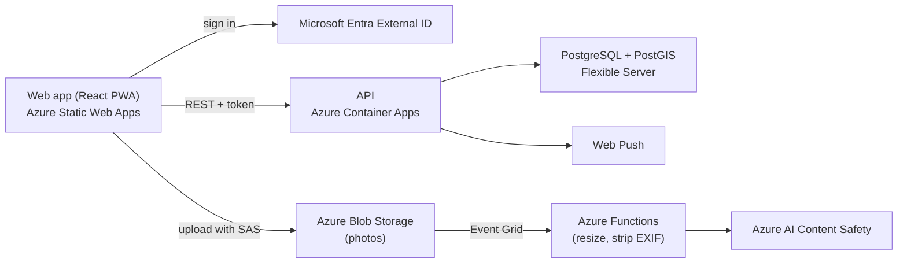

# WeHobby

**A hobby only social network.** Share the everyday side of your hobby (the half finished crochet piece, the new leaf, the photo that almost worked) with people who love the same thing, nearby or anywhere.

> 🚧 **Status:** in development. MVP in progress.
> 🌐 [wehobby.app](https://wehobby.app)

## Why WeHobby

Instagram and Facebook are a showcase for special moments. Facebook groups are fragmented and full of off topic content. WeHobby is different:

* **Hobbies only.** Every post belongs to a hobby community. Nothing else.
* **One community per hobby,** run by the platform, with filters instead of dozens of duplicate groups.
* **Near me.** See what people around you are making, growing and shooting.
* **No pressure posting.** Raw photos plus text. No filters, no editing, no stories.

The MVP launches with three communities: **crochet**, **plants** and **photography**, in Portuguese and English.

## MVP features

1. Sign up and log in (email or Google)
2. Pick your hobbies and hobby types (amigurumi, succulents, film photography...)
3. Set an approximate location (optional)
4. Post 1 to 5 photos with a caption, materials used and where you bought them
5. Community feed, sorted by newest or nearest, filtered by distance and hobby type
6. Like, comment, reply and follow, with in app and web push notifications
7. Profile that doubles as a hobby portfolio

Plus safety from day one: report, block, delete, automated content screening and GDPR data export and deletion.

## Architecture



Across all services: Key Vault, managed identities, Application Insights, infrastructure as code with Terraform (plan on every pull request, apply on merge) and deployments through GitHub Actions with OIDC (no stored cloud secrets).

## Tech stack

| Layer | Technology |
| --- | --- |
| Web | React, TypeScript, Vite, PWA, react-i18next (PT and EN) |
| API | Node.js, TypeScript, Fastify, Zod |
| Data | PostgreSQL with PostGIS for location queries |
| Storage | Azure Blob Storage, direct browser uploads with short lived SAS |
| Identity | Microsoft Entra External ID |
| Moderation | Azure AI Content Safety |
| Infrastructure as code | Terraform (azurerm), remote state in Azure Storage, TFLint and Trivy checks |
| Azure hosting | Container Apps, Static Web Apps, Functions, Key Vault |
| CI/CD | GitHub Actions with OIDC federation to Azure |
| Observability | Application Insights |

## Repository structure

```
web/        React PWA
api/        Node.js API
functions/  Azure Functions (image processing)
packages/   Shared TypeScript types and validation
infra/      Terraform modules and environments (dev, prod)
docs/       Product requirements and decisions
```

## Privacy by design

* Locations are rounded to about 1 km before they are stored, and only the city or area is ever shown.
* EXIF and GPS metadata are stripped from every photo.
* Users can export and delete all their data.
* All data stays in an Azure EU region.

## Roadmap

* **Phase 1:** MVP web app (in progress)
* **Phase 2:** native iOS and Android apps, direct messages, search, more hobbies
* **Phase 3:** local meetups and events, marketplace for handmade items and workshops

## Built with

Designed and built by [Giovanna Damasceno](https://github.com/gdamascenomoreira), with [Claude Code](https://claude.com/claude-code) as an AI pair programmer.

## License

Copyright © 2026 Giovanna Damasceno. All rights reserved.

The source code is public for portfolio and learning purposes. It may not be copied, modified or distributed without written permission.
