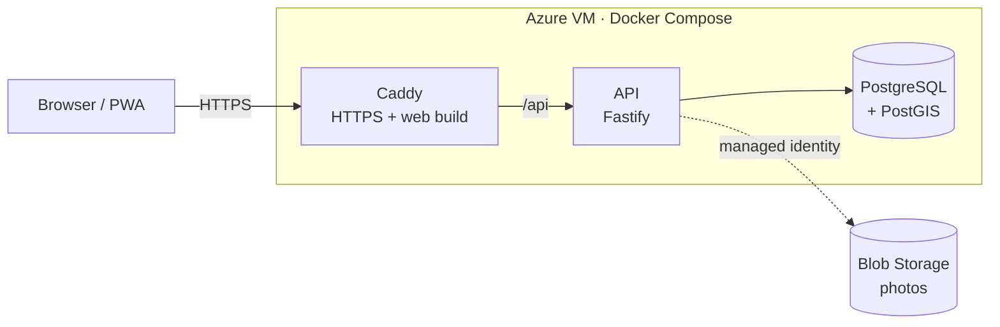

# WeHobby

**A hobby only social network.** Share the everyday side of your hobby (the half finished crochet piece, the new leaf, the photo that almost worked) with people who love the same thing, nearby or anywhere.

> 🚧 **Status:** in development. MVP in progress.
> 🌐 [wehobby.app](https://wehobby.app)

## Why WeHobby

Instagram and Facebook are a showcase for special moments. Facebook groups are fragmented and full of off topic content. WeHobby is different:

* **Hobbies only.** Every post belongs to a hobby community. Nothing else.
* **One community per hobby,** run by the platform, with filters instead of dozens of duplicate groups.
* **Near me.** See what people around you are making, growing and shooting.
* **No pressure posting.** Raw photos plus text. No filters, no editing, no stories.

The MVP launches with three communities: **crochet**, **plants** and **photography**, in Portuguese and English.

## MVP features

1. Sign up and log in (email or Google)
2. Pick your hobbies and hobby types (amigurumi, succulents, film photography...)
3. Set an approximate location (optional)
4. Post 1 to 5 photos with a caption, materials used and where you bought them
5. Community feed, sorted by newest or nearest, filtered by distance and hobby type
6. Like, comment, reply and follow, with in app and web push notifications
7. Profile that doubles as a hobby portfolio

Plus safety from day one: report, block, delete, automated content screening and GDPR data export and deletion.

## Architecture

The same container images run in several Azure infrastructure scenarios, compared on cost, effort and resilience (see [`docs/README.md`](docs/README.md)). Today the app runs on **scenario 01 (IaaS)**: one Ubuntu VM in North Europe.



* Caddy gets Let's Encrypt certificates, serves the web app and proxies `/api/*` to the API, so the browser sees a single origin and no CORS is needed.
* Only ports 80 and 443 are open. Admin access goes through Azure Bastion.
* The database lives on a separate data disk. Photos go to Blob Storage, reached with the VM's managed identity (no keys).
* Images are built by GitHub Actions and published to GitHub Container Registry. The VM runs a specific commit, set by `IMAGE_TAG`.

How the VM was built, step by step: [`docs/scenarios/01-iaas/portal-guide.md`](docs/scenarios/01-iaas/portal-guide.md).

## Tech stack

| Layer | Technology |
| --- | --- |
| Web | React, TypeScript, Vite, PWA, react-i18next (PT and EN) |
| API | Node.js, TypeScript, Fastify, Zod |
| Data | PostgreSQL with PostGIS for location queries |
| Storage | Azure Blob Storage, direct browser uploads with short lived SAS |
| Identity | Microsoft Entra External ID |
| Moderation | Azure AI Content Safety |
| Edge | Caddy (HTTPS with Let's Encrypt, static files, reverse proxy) |
| Hosting today | Azure VM with Docker Compose (scenario 01) |
| Hosting later | Container Apps, Static Web Apps, Functions, Key Vault (scenario 03), with Terraform (azurerm) |
| CI/CD | GitHub Actions, images on GitHub Container Registry |
| Observability | Application Insights |

## Repository structure

```
web/        React PWA, plus the Caddy edge image (Dockerfile, Caddyfile)
api/        Node.js API
packages/   Shared TypeScript types and validation
deploy/vm/  Docker Compose file that runs on the scenario 01 VM
functions/  Azure Functions (image processing, scenario 03)
infra/      Terraform modules and environments (scenario 03, on hold)
docs/       Product requirements, conventions and deployment guides
```

## Local development

Requires Node.js 24. Docker is optional for now.

```bash
npm install
cp api/.env.example api/.env.local
cp web/.env.example web/.env.local

npm run dev --workspace @wehobby/api   # http://localhost:3000/api/health
npm run dev --workspace @wehobby/web   # http://localhost:5173 (proxies /api to the API)

docker compose up -d                   # PostGIS and Azurite (not used by the code yet)
```

To run the production images exactly as on the VM, over plain HTTP:

```bash
docker build -f api/Dockerfile -t local/wehobby-api:dev .
docker build -f web/Dockerfile -t local/wehobby-web:dev .

cd deploy/vm
IMAGE_PREFIX=local IMAGE_TAG=dev SITE_ADDRESS=:80 DATA_DIR=./.data \
  POSTGRES_PASSWORD=local-only docker compose up -d   # http://localhost
```

Checks run in CI on every pull request: `npm run lint`, `npm run typecheck`, `npm test`, `npm run build`, and a build of both images with a smoke test of the VM stack.

## Privacy by design

* Locations are rounded to about 1 km before they are stored, and only the city or area is ever shown.
* EXIF and GPS metadata are stripped from every photo.
* Users can export and delete all their data.
* All data stays in an Azure EU region.

## Roadmap

* **Phase 1:** MVP web app (in progress)
* **Phase 2:** native iOS and Android apps, direct messages, search, more hobbies
* **Phase 3:** local meetups and events, marketplace for handmade items and workshops

## Built with

Designed and built by [Giovanna Damasceno](https://github.com/gdamascenomoreira), with [Claude Code](https://claude.com/claude-code) as an AI pair programmer.

## License

Copyright © 2026 Giovanna Damasceno. All rights reserved.

The source code is public for portfolio and learning purposes. It may not be copied, modified or distributed without written permission.
