# Scenario 01: IaaS portal guide

Step by step guide for building scenario 01 manually in the Azure portal. Settings and decisions are recorded in the [deployment log](deployment-log.md); this page shows **how** to do it, with screenshots.

> Before adding screenshots, hide subscription ID, tenant ID, email addresses and public IPs.

**Date built:*2026 October*
---

## Step 1: Resource group

1. Search **Resource groups** → **Create**
2. **Basics**
   - Subscription: _your subscription_
   - Resource group: `rg-wehobby-iaas-dev`
   - Region: North Europe
3. **Tags**

   | Name | Value |
   |---|---|
   | project | wehobby |
   | environment | dev |
   | managed_by | portal |
   | scenario | 01-iaas |

4. **Review + create** → **Create**

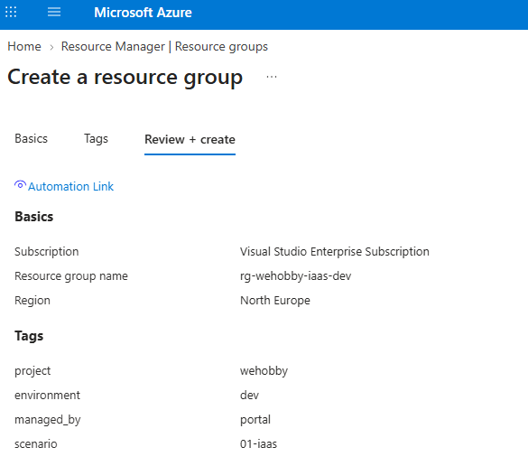

---

## Step 2: Budget alert

1. Open `rg-wehobby-iaas-dev` → **Cost Management** → **Budgets** → **Add**
2. **Create a budget**
   - Name: `budget-wehobby-iaas-dev`
   - Reset period: Billing Month
   - Amount: _€_
3. **Set alerts**
   - Actual: 50%, 80%
   - Forecasted: 100%
   - Recipients: _your email 
4. **Create**

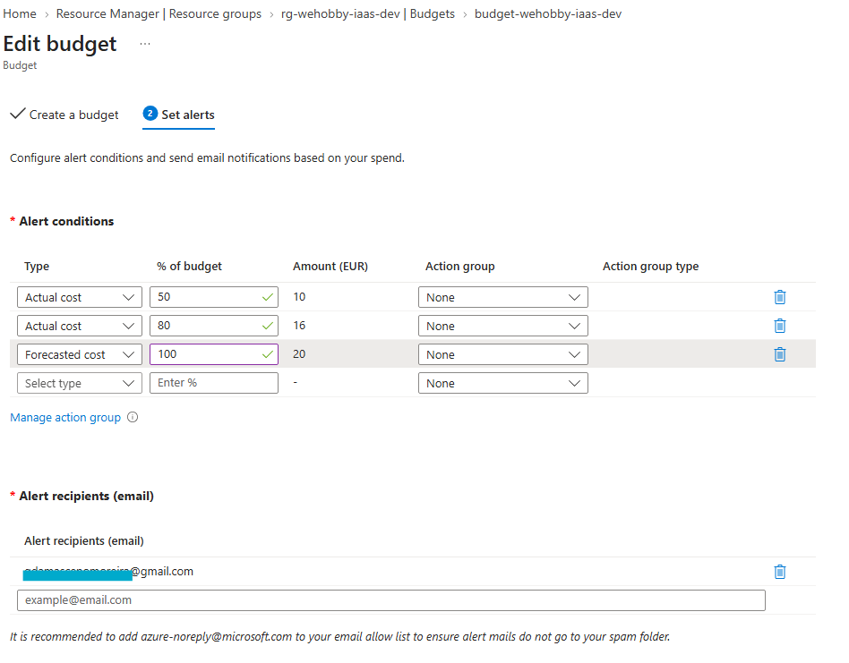

> **Good to know:** a budget only alerts, it never stops spending. Cost data can lag by several hours.

> **My notes:**
>As I am using a  Visual Studio subscription, it is important to use Billing Month instead of Monthly as the invoice period may be different.

Documentation related:
[Use cost alerts to monitor usage and spending](https://learn.microsoft.com/en-us/azure/cost-management-billing/costs/cost-mgt-alerts-monitor-usage-spending)
[Tutorial: Create and manage budgets](https://learn.microsoft.com/en-us/azure/cost-management-billing/costs/tutorial-acm-create-budgets?tabs=psbudget)

---

## Step 3: Virtual network

1. Search **Virtual networks** → **Create**
2. **Basics**
   - Resource group: `rg-wehobby-iaas-dev`
   - Name: `vnet-wehobby-iaas-dev`
   - Region: North Europe
3. **Security**: leave Bastion, Firewall and DDoS Protection off (cost)
4. **IP addresses**
   - Address space: `10.10.0.0/16`
   - Edit the default subnet:
     - Name: `snet-app`
     - Range: `10.10.1.0/24`
     - Service endpoints: `Microsoft.Storage.Global`
5. **Tags**: same four tags as step 1
6. **Review + create** → **Create**

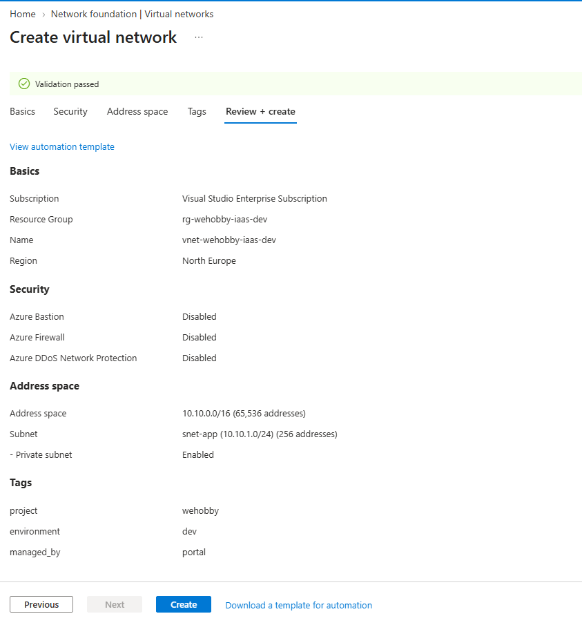
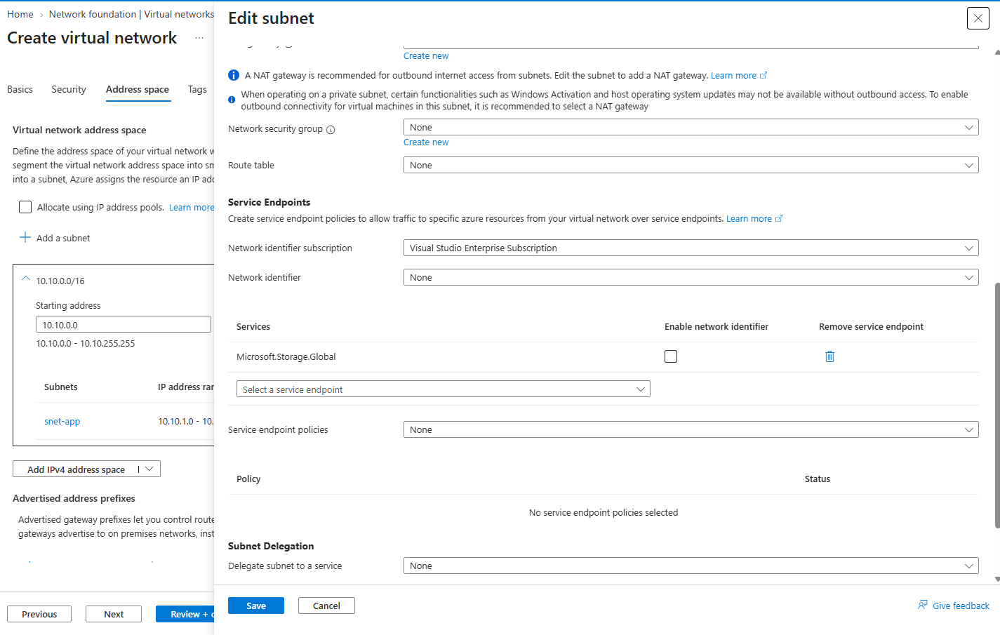


---

## Step 4: Network security group

1. Search **Network security groups** → **Create**
   - Resource group: `rg-wehobby-iaas-dev`
   - Name: `nsg-wehobby-iaas-dev`
   - Region: North Europe
   - Tags: same four tags

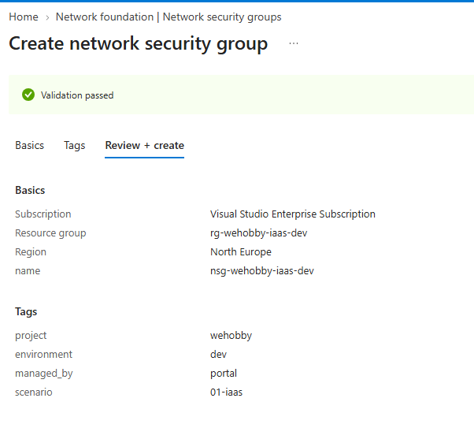

2. Open the NSG → **Inbound security rules** → **Add**

   | Name | Source | Destination ports | Protocol | Action | Priority |
   |---|---|---|---|---|---|
   | Allow-HTTP-HTTPS | Service Tag: Internet | 80, 443 | TCP | Allow | 100 |
   | Allow-SSH-MyIP | IP addresses: _my public IP_ | 22 | TCP | Allow | 110 |


   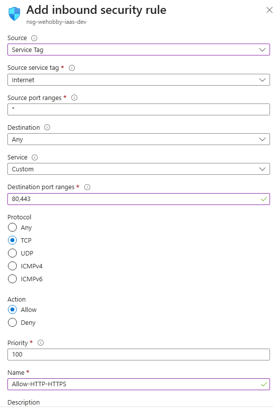

   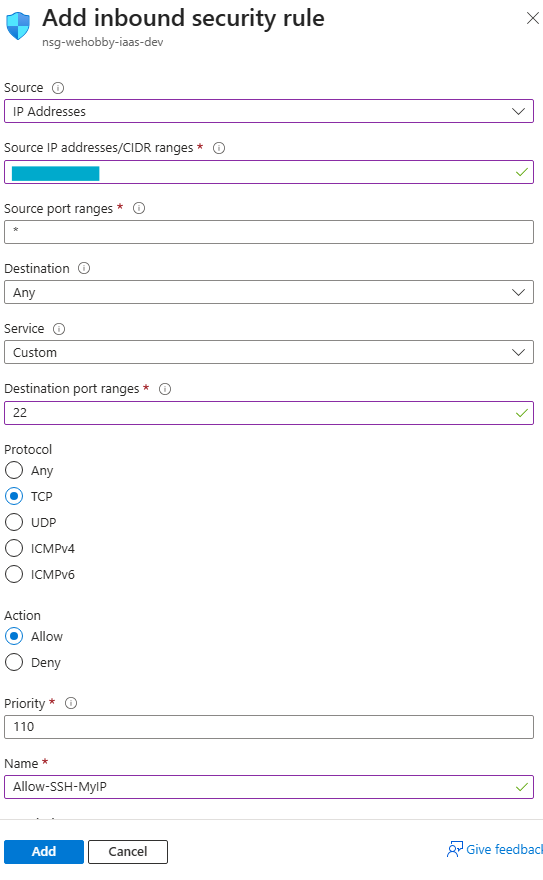

3. **Subnets** → **Associate** → `vnet-wehobby-iaas-dev` / `snet-app`

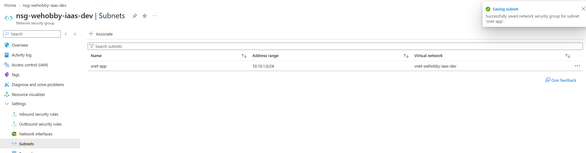

---

## Step 5: Storage account

1. Search **Storage accounts** → **Create**
2. **Basics**
   - Resource group: `rg-wehobby-iaas-dev`
   - Name: `stwehobbyiaasdev`
   - Region: North Europe
   - Performance: Standard
   - Redundancy: LRS
3. **Advanced**
   - Allow enabling anonymous access on containers: off
   - Enable storage account key access: on
   - Minimum TLS version: 1.2
   - Access tier: Hot
4. **Networking**
   - Public network access: enabled from selected virtual networks and IP addresses
   - Virtual network: `vnet-wehobby-iaas-dev` / `snet-app`
   - Add your client IP address
5. **Tags**: same four tags
6. **Review + create** → **Create**

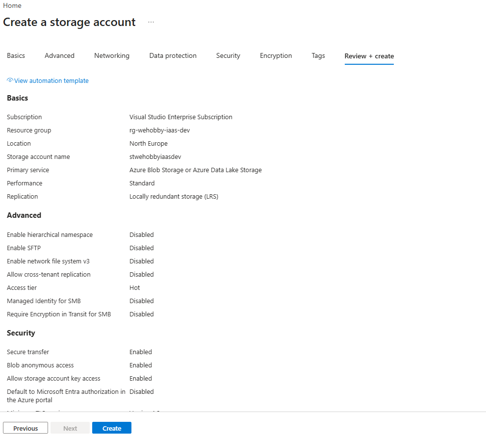

7. Open the account → **Containers** → **+ Container** → name `photos`, private access

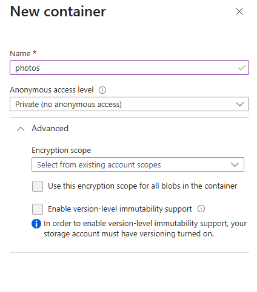

> **Good to know:** if key access is disabled, you need a data role (e.g. Storage Blob Data Contributor) on your own account to browse blobs in the portal.

> **My notes:**
>  I did not enable hierarchical namespace. It's designed for analytics workloads: real directories with atomic rename and delete, and POSIX style ACLs per file and folder, used by Spark, Databricks, Synapse and so on. WeHobby just stores photos and reads and writes them through the Blob API.

---

## Step 6: Virtual machine

1. Search **Virtual machines** → **Create** → **Azure virtual machine**
2. **Basics**
   - Resource group: `rg-wehobby-iaas-dev`
   - Name: `vm-wehobby-iaas-dev-01`
   - Region: North Europe
   - Availability options: no infrastructure redundancy required
   - Image: Ubuntu Server 24.04 LTS
   - Size: B2als v2
   - Authentication: SSH public key, username `azureuser`, generate new key pair
   - Public inbound ports: None (the subnet NSG controls access)
3. **Disks**
   - OS disk type: Standard SSD
   - **Create and attach a new disk**: name `disk-vm-wehobby-iaas-dev-01-data`, Standard SSD, 32 GiB
4. **Networking**
   - Virtual network: `vnet-wehobby-iaas-dev`, subnet `snet-app`
   - Public IP: create new, name `pip-vm-wehobby-iaas-dev-01`, Standard SKU, static
   - NIC network security group: None
5. **Management**
   - System assigned managed identity: on
   - Auto shutdown: on, time _:_, time zone _ _
6. **Monitoring**
   - Boot diagnostics: enable with managed storage account
7. **Tags**: same four tags
8. **Review + create** → **Create** → download the private key and keep it safe (never commit it)
9. Open the public IP → **Configuration** → set a DNS name label

[VM basics](images/creatingvm.png)


> **Good to know:** some generated names (e.g. OS disk, NIC) may not be editable in the wizard. Write down the names Azure created.

---

## Step 7: Role assignment

1. Open `stwehobbyiaasdev` → **Access control (IAM)** → **Add** → **Add role assignment**
2. Role: **Storage Blob Data Contributor**
3. Members: **Managed identity** → Virtual machine → `vm-wehobby-iaas-dev-01`
4. **Review + assign**

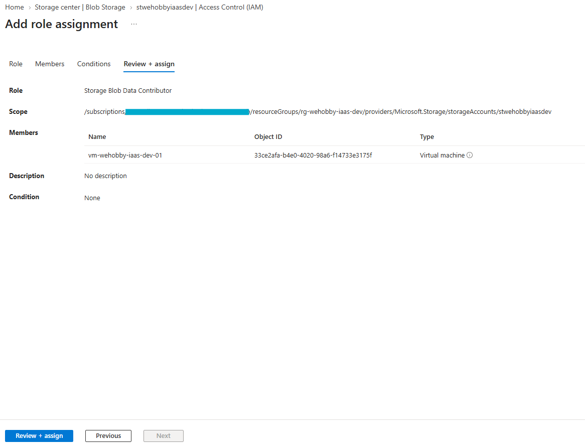

---

## Step 8: DNS (Azure DNS zone)

The domain `wehobby.app` was bought at Porkbun. DNS is delegated to an Azure DNS zone so records can be managed in Azure, Bicep and Terraform. The zone lives in a shared resource group because it must outlive the scenario resource groups.

### 8a. Shared resource group

1. Search **Resource groups** → **Create**
   - Resource group: `rg-wehobby-shared`
   - Region: North Europe
2. **Tags**

   | Name | Value |
   |---|---|
   | project | wehobby |
   | environment | dev |
   | managed_by | portal |
   | scenario | shared |

3. **Review + create** → **Create**
4. Open `rg-wehobby-shared` → **Settings** → **Locks** → **Add**
   - Lock name: `lock-wehobby-shared`
   - Lock type: Delete

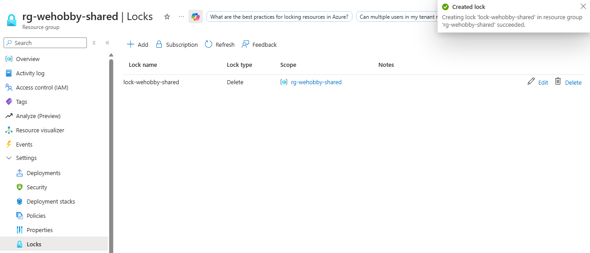 


> **Good to know:** the delete lock protects the zone from accidental deletion when tearing down scenarios.


### 8b. DNS zone

1. Search **DNS zones** → **Create**
   - Resource group: `rg-wehobby-shared`
   - Name: `wehobby.app`
2. **Tags**: same as the shared resource group
3. **Review + create** → **Create**
4. Open the zone → **Overview** → copy the 4 name servers

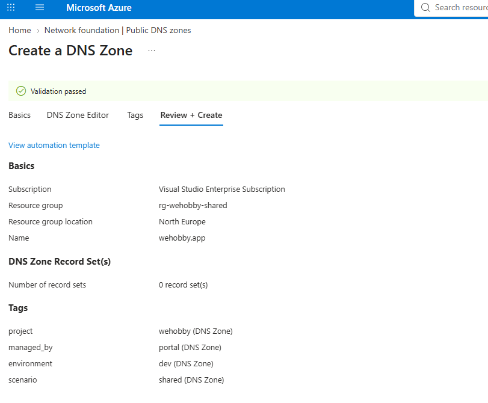 


### 8c. Alias record for the VM

1. In the zone → **Recordsets** → **Add**

   | Field | Value |
   |---|---|
   | Name | `iaas` |
   | Type | A |
   | Alias record set | Yes |
   | Alias type | Azure resource |
   | Azure resource | `pip-vm-wehobby-iaas-dev-01` |
   | TTL | 1 hour |

2. **Add**

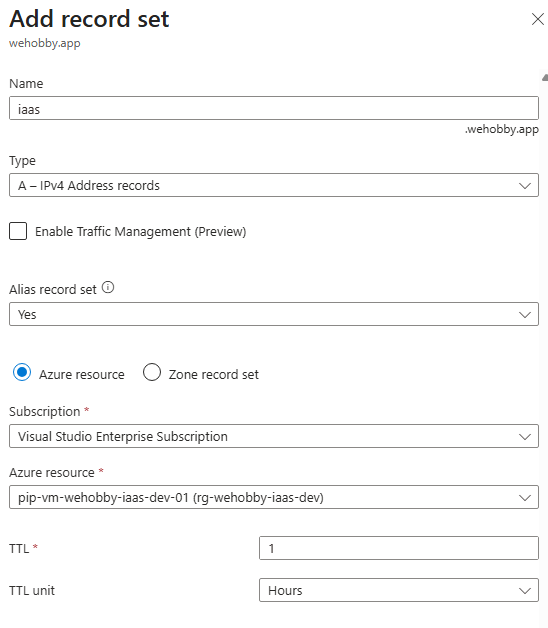

> **Good to know:** an alias record points to the public IP resource, not a typed IP. It updates if the IP changes and stops resolving when the IP is deleted, which prevents dangling DNS and subdomain takeover.


### 8d. Check Porkbun before switching

1. In Porkbun → **Domain Management** → `wehobby.app` → **Details** → **DNS & Nameservers**
2. Checked:

   | Item | Value | Result |
   |---|---|---|
   | Nameservers | `curitiba`, `fortaleza`, `maceio`, `salvador` `.ns.porkbun.com` | To be replaced in 8e |
   | DNS records | 2 records (Porkbun parking: ALIAS and wildcard CNAME to `pixie.porkbun.com`) | Not needed, not migrated |
   | Registry DNSSEC | 0 records | OK |
   | Porkbun DNSSEC | Off | OK |
   | URL forwarding | Not set | OK |
   | Glue records | None | OK |

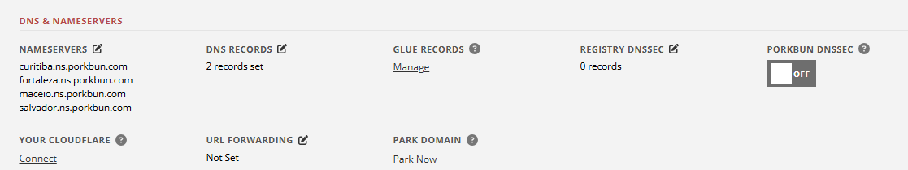

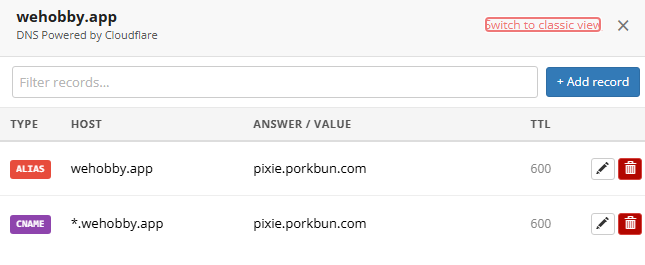


> **Good to know:** URL forwarding and email forwarding at the registrar depend on the registrar's DNS. Changing nameservers silently breaks them, so check before switching.

> **My notes:**
> These pixie.porkbun.com records can be ignore. I did not move them to Azure.

### 8e. Switch nameservers in Porkbun

1. Azure portal → **DNS zones** → `wehobby.app` → **Overview** → copy Name server 1 to 4
2. Porkbun → **Domain Management** → `wehobby.app` → **Details** → pencil icon next to **Nameservers**
3. Delete the Porkbun nameservers (`curitiba`, `fortaleza`, `maceio`, `salvador` `.ns.porkbun.com`)
4. Enter the 4 Azure nameservers, one per line, without the trailing dot:

   | # | Nameserver |
   |---|---|
   | 1 | `ns1-XX.azure-dns.com` |
   | 2 | `ns2-XX.azure-dns.net` |
   | 3 | `ns3-XX.azure-dns.org` |
   | 4 | `ns4-XX.azure-dns.info` |

5. **Submit**

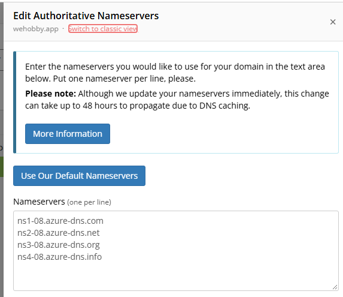

> **Good to know:** Azure assigns a unique set of nameservers per zone, spread across 4 top level domains (.com, .net, .org, .info) for resilience. If you delete and recreate the zone, you may get different nameservers and must update the registrar again. Another reason for the delete lock.


### 8f. Verify

2. Check the public delegation:

```powershell
nslookup iaas.wehobby.app ns1-08.azure-dns.com```
nslookup -type=NS wehobby.app
```

   Expected: the 4 Azure nameservers, and the VM public IP as a non-authoritative answer.

3. Result:

   | Check | Result |
   |---|---|
   | `iaas.wehobby.app` via public resolver | `20.107.217.244` (matches `pip-vm-wehobby-iaas-dev-01`) |
   | NS records for `wehobby.app` | |
   | Propagation time | 3 Minutes |

Expected: the Azure nameservers, and the VM public IP.

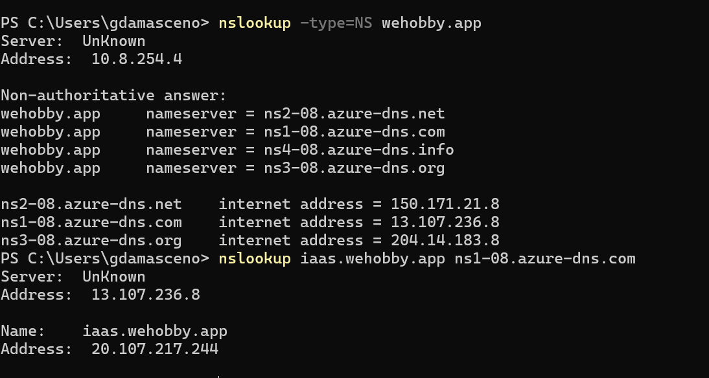

> **Good to know:** "Server: UnKnown" in nslookup only means the DNS server's IP has no reverse DNS (PTR) record. It doesn't affect the answer

> **My notes:**
> -type=NS tells nslookup which kind of DNS record to ask for. A DNS zone holds different record types for the same name, and without the option, nslookup asks for the IP address (A or AAAA records) by default.
> NS stands for Name Server. An NS record answers the question "which servers are in charge of this domain?" So nslookup -type=NS wehobby.app means: "who is authoritative for wehobby.app?" That's how you confirmed the delegation moved from Porkbun to Azure.

---

## Step 9: VM configuration

### 9a. Connect with Azure Bastion Developer

SSH from the corporate device was blocked by the company network ("Software caused connection abort"). Bastion Developer connects through the Azure portal over HTTPS, so it works from any network and SSH no longer depends on a source IP.

#### Deploy and connect

1. Open `vm-wehobby-iaas-dev-01` → **Connect** → **Bastion**
2. Deploy **Bastion Developer** (created as `vnet-wehobby-iaas-dev-bastion`)
3. Authentication type: **Private Key from Local File**
4. Username: `azureuser`
5. Local file: the `.pem` private key downloaded when the VM was created
6. **Connect**. A terminal opens in a new browser tab
7. Test:

```bash
   whoami
   hostname
```

   Result: `azureuser` and `vm-wehobby-iaas-dev-01` ✅

<!--  -->
<!--  -->

#### Clean up the NSG

1. Open `nsg-wehobby-iaas-dev` → **Inbound security rules**
2. Delete `Allow-SSH-MyIP`

> **Good to know:** no NSG rule was needed for Bastion Developer. It connects from the Azure platform IP `168.63.129.16`, which is already allowed by the default rule `AllowAzureLoadBalancerInBound` (the `AzureLoadBalancer` service tag includes it). A custom "deny all inbound" rule would break Bastion.

> **Good to know:** Bastion Developer is free, needs no `AzureBastionSubnet` and no public IP, but allows only one session at a time, no file transfer and no native client. The portal also warns it's not for production.

> **Naming exception:** the portal named the Bastion `vnet-wehobby-iaas-dev-bastion`. Azure resources can't be renamed, so it stays. In Bicep and Terraform it will be `bas-wehobby-iaas-dev`.


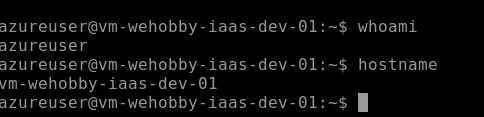 

## Architecture on the VM

| Layer | Technology | Container | Port | Exposed to internet |
|---|---|---|---|---|
| Reverse proxy and HTTPS | Caddy (Let's Encrypt) | `caddy` | 80, 443 | Yes |
| Frontend | React PWA (static files served by Caddy) | `caddy` | | Through Caddy |
| Backend (API) | Node.js + Fastify | `api` | 3000 | No, through Caddy `/api` |
| Database | PostgreSQL + PostGIS (`postgis/postgis`) | `db` | 5432 | No, VM only |
| Photos | Azure Blob Storage `photos` container | Outside the VM | | Through short lived SAS tokens |

- The browser never talks to the database. All data access goes through the API.
- Database files live on the data disk, separate from the OS disk.
- The API reaches Blob Storage with the VM's managed identity (no keys).

### Why PostgreSQL

- **PostGIS** for the "near me" feed: geographic queries and spatial indexes
- **Relational data**: users, posts, follows, likes, comments
- **Same engine in every scenario**: Docker on the VM here, Azure Database for PostgreSQL Flexible Server in PaaS. The app doesn't change between scenarios
- **Open source**: no licence cost

| Alternative | Why not |
|---|---|
| Azure SQL | Higher cost, less suited to self hosting on a Linux VM |
| Cosmos DB | NoSQL, relational features (follows, likes) are awkward. Used in optional scenario 5 as a contrast |
| MySQL | Weaker spatial support than PostGIS |

### 9b. Mount the data disk

The 32 GiB data disk (LUN 0) is attached to the VM but empty: no partition, no file system, not mounted. It will hold the PostgreSQL data and the Caddy certificates.

#### 1. Find the disk

```bash
lsblk -o NAME,SIZE,TYPE,FSTYPE,MOUNTPOINT
ls -l /dev/disk/azure/scsi1/
```

Expected:
- A disk of about **32G** with **no partitions and no mount point** (usually `sdc`, but the name can vary). Here is sdb.
- In `/dev/disk/azure/scsi1/`, an entry `lun0` pointing to that disk

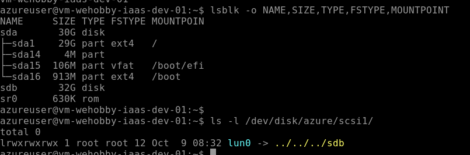 


| Check | Result |
|---|---|
| Data disk device name | sdb |
| Size | |
| `lun0` points to it | ../../../sdb |

> **Good to know:** Linux device names like `/dev/sdc` can change between reboots. Azure Ubuntu images add stable paths by LUN in `/dev/disk/azure/scsi1/`, so the commands below use `lun0`, which always matches the LUN set in the portal.

#### 2. Partition and format

```bash
sudo parted /dev/disk/azure/scsi1/lun0 --script mklabel gpt mkpart datadisk ext4 0% 100%
sudo partprobe
sudo mkfs.ext4 -L datadisk /dev/disk/azure/scsi1/lun0-part1
```

| Command | What it does |
|---|---|
| `parted ... mklabel gpt` | Creates a GPT partition table |
| `mkpart datadisk ext4 0% 100%` | One partition using the whole disk |
| `partprobe` | Tells the kernel about the new partition |
| `mkfs.ext4 -L datadisk` | Formats it as ext4 with the label `datadisk` |


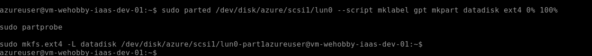

#### 3. Mount it

```bash
sudo mkdir -p /datadisk
sudo mount /dev/disk/azure/scsi1/lun0-part1 /datadisk
df -h /datadisk
```

Expected: `/datadisk` with about 31G available.

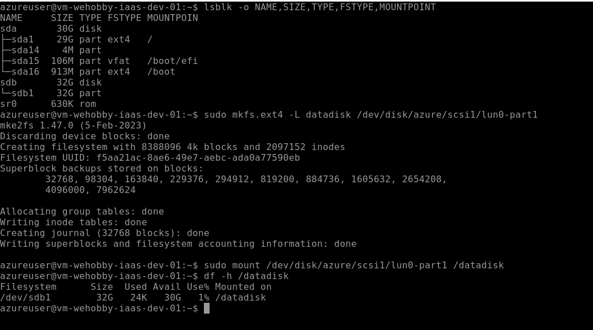

#### 4. Mount automatically at boot

Get the partition's UUID:

```bash
sudo blkid /dev/disk/azure/scsi1/lun0-part1
```

Copy the `UUID="..."` value, then add it to `/etc/fstab`: f5aa21ac-8ae6-49e7-aebc-ada0a77590eb

```bash
echo 'UUID=f5aa21ac-8ae6-49e7-aebc-ada0a77590eb /datadisk ext4 defaults,nofail 0 2' | sudo tee -a /etc/fstab
```

Test the fstab entry without rebooting:

```bash
sudo umount /datadisk
sudo mount -a
df -h /datadisk
```

Expected: `/datadisk` is mounted again. If `mount -a` shows an error, fix `/etc/fstab` before rebooting (`sudo nano /etc/fstab`).

| fstab field | Value | Meaning |
|---|---|---|
| Device | `UUID=...` | Identifies the partition reliably |
| Mount point | `/datadisk` | |
| Type | `ext4` | |
| Options | `defaults,nofail` | `nofail`: the VM still boots if the disk is missing |
| Dump | `0` | No legacy backup |
| Pass | `2` | Check the file system at boot, after the OS disk |


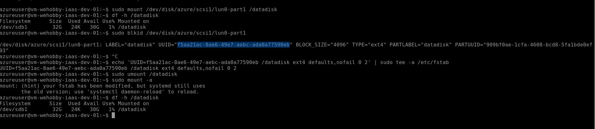

> **Good to know:** without `nofail`, a detached or failed data disk stops the VM from booting, and the only way in is the serial console. Microsoft recommends `nofail` for every Azure data disk.
>  After editing `/etc/fstab`, `mount -a` shows "your fstab has been modified, but systemd still uses the old version". It's only a hint: run `sudo systemctl daemon-reload` so systemd reloads its generated mount units.

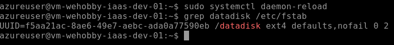

#### 5. Create the folders

```bash
sudo mkdir -p /datadisk/postgres /datadisk/caddy
ls -l /datadisk
```

Expected: `caddy`, `postgres` and `lost+found` (created by ext4).

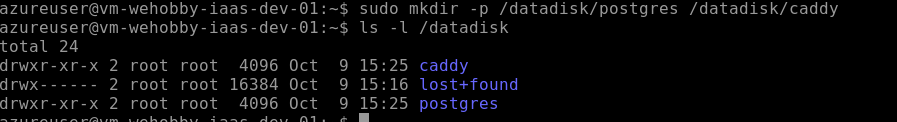

#### 6. Reboot test (optional, recommended)

```bash
sudo reboot
```

Reconnect with Bastion after a minute, then:

```bash
df -h /datadisk
```

Expected: still mounted.

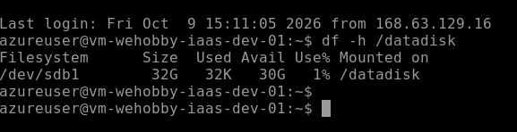

#### Result

| Check | Result |
|---|---|
| Device | `/dev/sdb1` (via `/dev/disk/azure/scsi1/lun0-part1`) |
| File system | ext4, label `datadisk` |
| UUID | `f5aa21ac-8ae6-49e7-aebc-ada0a77590eb` |
| fstab entry | `UUID=f5aa21ac-8ae6-49e7-aebc-ada0a77590eb /datadisk ext4 defaults,nofail 0 2` |
| `mount -a` test | ✅ mounted, 32G size, 30G available |
| Folders | `/datadisk/postgres`, `/datadisk/caddy` |
| Survives reboot | |


> **Good to know:** a 32 GiB disk shows 30G available after formatting. ext4 reserves about 5% for the root user plus space for its metadata.

> **My notes:**
> These steps are documented here: [Use the portal to attach a data disk to a Linux VM](https://learn.microsoft.com/en-us/azure/virtual-machines/linux/attach-disk-portal?tabs=scsi)

### 9c. Install Docker

Docker Engine and the Compose plugin are installed from Docker's official apt repository (newer than Ubuntu's `docker.io` package and includes `docker compose` v2).

#### 1. Prerequisites

```bash
sudo apt-get update
```

```bash
sudo apt-get install -y ca-certificates curl
```
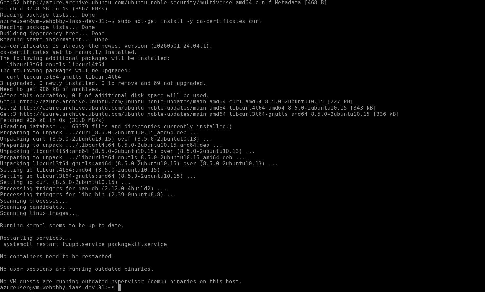

#### 2. Add Docker's signing key

```bash
sudo install -m 0755 -d /etc/apt/keyrings
```

```bash
sudo curl -fsSL https://download.docker.com/linux/ubuntu/gpg -o /etc/apt/keyrings/docker.asc
```

```bash
sudo chmod a+r /etc/apt/keyrings/docker.asc
```

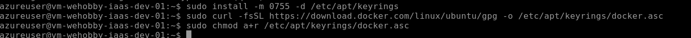

#### 3. Add Docker's repository

```bash
echo "deb [arch=$(dpkg --print-architecture) signed-by=/etc/apt/keyrings/docker.asc] https://download.docker.com/linux/ubuntu $(. /etc/os-release && echo "$VERSION_CODENAME") stable" | sudo tee /etc/apt/sources.list.d/docker.list
```

Expected output: a line ending in `noble stable` (Ubuntu 24.04's codename).

#### 4. Install Docker

```bash
sudo apt-get update
```

```bash
sudo apt-get install -y docker-ce docker-ce-cli containerd.io docker-buildx-plugin docker-compose-plugin
```

| Package | What it is |
|---|---|
| `docker-ce` | Docker Engine (the daemon) |
| `docker-ce-cli` | The `docker` command |
| `containerd.io` | Container runtime used by Docker |
| `docker-buildx-plugin` | Image builder |
| `docker-compose-plugin` | `docker compose`, runs multi container stacks |

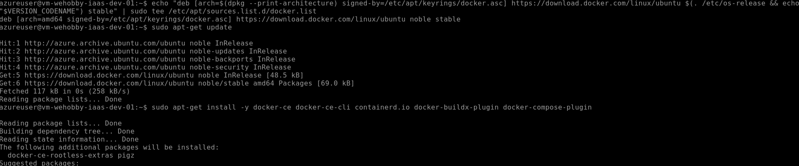


#### 5. Test

```bash
sudo docker run hello-world
```

Expected: "Hello from Docker!"

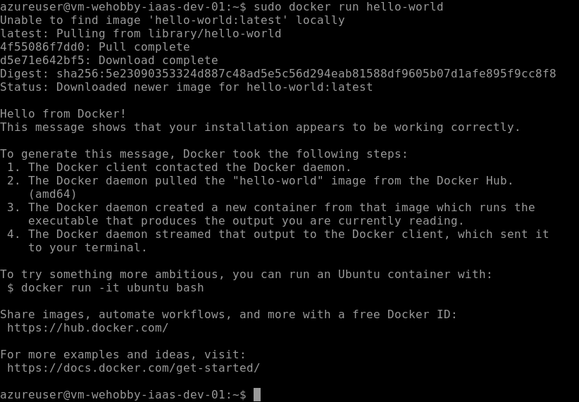

```bash
docker compose version
```

```bash
systemctl is-enabled docker
```

Expected: a Compose version (v2.x) and `enabled` (Docker starts at boot).

#### 6. Run docker without sudo

```bash
sudo usermod -aG docker azureuser
```

Close the Bastion tab and reconnect (group changes apply at the next login), then:

```bash
docker ps
```

Expected: an empty list, no "permission denied".

> **Good to know:** members of the `docker` group effectively have root access on the VM. Fine for a single admin VM, but in shared environments keep using `sudo`.

#### 7. Limit container log size

By default Docker keeps container logs forever, which can fill the OS disk. The `local` log driver rotates and compresses them automatically.

```bash
echo '{"log-driver":"local"}' | sudo tee /etc/docker/daemon.json
```

```bash
sudo systemctl restart docker
```

```bash
docker info --format '{{.LoggingDriver}}'
```

Expected: `local`

#### Result

| Check | Result |
|---|---|
| Docker version (`docker --version`) | |
| Compose version | |
| `hello-world` | |
| Starts at boot | |
| `docker ps` without sudo | |
| Log driver | `local` |

> **Good to know:** the VM can download packages because it has a public IP. The subnet is a private subnet (no default outbound access), so a VM without a public IP would need a NAT gateway for `apt` and `docker pull` to work.

> **My notes:**
> [Install Docker Engine on Ubuntu](https://docs.docker.com/engine/install/ubuntu/)
> [Linux post-installation steps for Docker Engine](https://docs.docker.com/engine/install/linux-postinstall/)

### 9d. Docker Compose stack

Caddy (HTTPS), PostgreSQL + PostGIS and a placeholder page, to prove the infrastructure works before the app exists. The real frontend and API are added when Slice 1 is ready.

| Container | Image | Ports | Data |
|---|---|---|---|
| `caddy` | `caddy:2` | 80, 443 (public) | `/datadisk/caddy` |
| `db` | `postgis/postgis:17-3.5` | 5432 (internal only) | `/datadisk/postgres` |

#### 1. Project folder

```bash
sudo mkdir -p /opt/wehobby/site
```

```bash
sudo chown -R azureuser:azureuser /opt/wehobby
```

```bash
cd /opt/wehobby
```

#### 2. Database password

```bash
echo "POSTGRES_PASSWORD=$(openssl rand -hex 24)" > /opt/wehobby/.env
```

```bash
chmod 600 /opt/wehobby/.env
```

> **Good to know:** `.env` holds the database password. It lives only on the VM, is readable only by `azureuser`, and is never committed to GitHub. Docker Compose reads it automatically from the project folder.

#### 3. compose.yaml
Run:
```bash
nano compose.yaml
```
The editor opens. You'll see GNU nano at the top and a shortcut menu at the bottom (^O Write Out, ^X Exit and so on; ^ means Ctrl)
Paste with Ctrl+Shift+V or right-click. The browser may ask for clipboard permission the first time; allow it
```yaml
services:
  caddy:
    image: caddy:2
    restart: unless-stopped
    ports:
      - "80:80"
      - "443:443"
    volumes:
      - ./Caddyfile:/etc/caddy/Caddyfile:ro
      - ./site:/srv:ro
      - /datadisk/caddy/data:/data
      - /datadisk/caddy/config:/config

  db:
    image: postgis/postgis:17-3.5
    restart: unless-stopped
    environment:
      POSTGRES_DB: wehobby
      POSTGRES_USER: wehobby
      POSTGRES_PASSWORD: ${POSTGRES_PASSWORD}
    volumes:
      - /datadisk/postgres:/var/lib/postgresql/data
    healthcheck:
      test: ["CMD-SHELL", "pg_isready -U wehobby -d wehobby"]
      interval: 10s
      timeout: 5s
      retries: 5
```
Save: Ctrl+O, then Enter to confirm the file name
Exit: Ctrl+X
Check what was saved:
```bash
cat compose.yaml
```

| Setting | Why |
|---|---|
| `restart: unless-stopped` | Containers start again after a reboot or crash |
| `db` has no `ports` | PostgreSQL is reachable only by other containers, never from the internet |
| Images pinned (`17-3.5`) | Predictable upgrades, same version in every rebuild |
| Volumes on `/datadisk` | Database and certificates survive container and OS disk rebuilds |

#### 4. Caddyfile

```bash
nano Caddyfile
```

Paste:

```text
iaas.wehobby.app {
    encode gzip
    respond /health "ok" 200
    root * /srv
    file_server
}
```

| Line | What it does |
|---|---|
| `iaas.wehobby.app {` | Site address. Caddy requests a Let's Encrypt certificate for it automatically |
| `encode gzip` | Compresses responses |
| `respond /health "ok" 200` | Health endpoint for monitoring and load tests |
| `root * /srv` + `file_server` | Serves the static files from `site/` |

#### 5. Placeholder page

```bash
nano site/index.html
```

Paste:

```html
<!doctype html>
<html lang="en">
<head>
  <meta charset="utf-8">
  <meta name="viewport" content="width=device-width, initial-scale=1">
  <title>WeHobby | Scenario 01 IaaS</title>
</head>
<body>
  <h1>WeHobby</h1>
  <p>Scenario 01: IaaS. Served by Caddy on an Azure VM.</p>
</body>
</html>
```

#### 6. Validate and start

```bash
docker compose config --quiet
```

No output means the file is valid. (Without `--quiet` it would print the password.)

```bash
docker compose up -d
```

```bash
docker compose ps
```

Expected: `caddy` running, `db` running and `healthy` (can take 30 seconds).

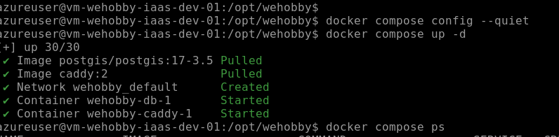

```bash
docker compose logs caddy --tail 30
```

Look for `certificate obtained successfully` for `iaas.wehobby.app`.

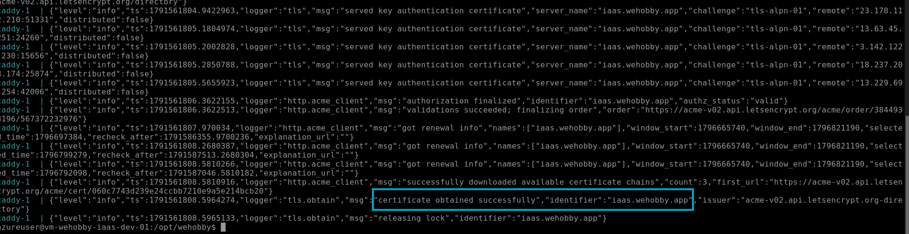


#### 7. Test

From your computer, open `https://iaas.wehobby.app` and `https://iaas.wehobby.app/health`.

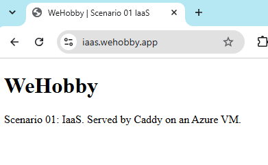

From the VM:

```bash
curl -I https://iaas.wehobby.app
```

Expected: `HTTP/2 200`.

| Check | Result |
|---|---|
| `docker compose ps` | |
| Certificate obtained | |
| `https://iaas.wehobby.app` | |
| `/health` | |

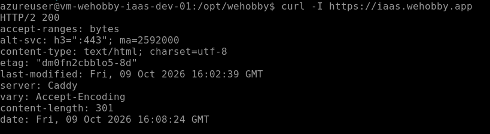

> **Good to know:** Caddy gets the certificate through the HTTP-01 challenge: Let's Encrypt calls `http://iaas.wehobby.app/.well-known/acme-challenge/...` on port 80. That's why port 80 stays open in the NSG even though `.app` forces HTTPS in browsers.

---

### 9e. Test the database

#### 1. Connect and check versions

```bash
docker compose exec db psql -U wehobby -d wehobby -c "SELECT version();"
```

```bash
docker compose exec db psql -U wehobby -d wehobby -c "SELECT PostGIS_Version();"
```

The `postgis/postgis` image enables the PostGIS extension in the `wehobby` database automatically.

#### 2. Try a geographic query

Distance between Lisbon and Porto, in km:

```bash
docker compose exec db psql -U wehobby -d wehobby -c "SELECT round((ST_Distance(ST_MakePoint(-9.1393, 38.7223)::geography, ST_MakePoint(-8.6291, 41.1579)::geography) / 1000)::numeric, 1) AS km;"
```

Expected: about 274 km. This is the kind of query the "near me" feed will use.

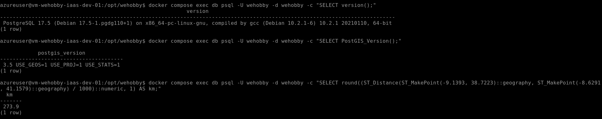

#### 3. Data is on the data disk

```bash
sudo du -sh /datadisk/postgres
```

Expected: a few dozen MB.

#### 4. Port 5432 is not exposed

```bash
sudo ss -tlnp | grep -E ':(80|443|5432) '
```

Expected: ports 80 and 443 listening, **no** 5432.

#### 5. Data survives a container rebuild

```bash
docker compose exec db psql -U wehobby -d wehobby -c "CREATE TABLE smoke_test (id serial PRIMARY KEY, note text); INSERT INTO smoke_test (note) VALUES ('survived');"
```

```bash
docker compose down
```

```bash
docker compose up -d
```

```bash
docker compose exec db psql -U wehobby -d wehobby -c "SELECT * FROM smoke_test;"
```

Expected: the row `survived`. Then clean up:

```bash
docker compose exec db psql -U wehobby -d wehobby -c "DROP TABLE smoke_test;"
```
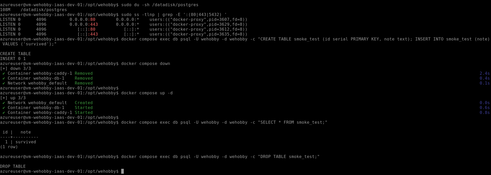

| Check | Result |
|---|---|
| PostgreSQL version |  PostgreSQL 17.5 (Debian 17.5-1.pgdg110+1) on x86_64-pc-linux-gnu, compiled by gcc (Debian 10.2.1-6) 10.2.1 20210110, 64-bit |
| PostGIS version | 3.5 USE_GEOS=1 USE_PROJ=1 USE_STATS=1 |
| Lisbon to Porto | 273.9 km |
| Size on `/datadisk/postgres` | 108M |
| 5432 not listening on host | yes |
| Data survives `down` and `up` | up |

> **Good to know:** `docker compose down` deletes the containers, not the data. Because the database files are on `/datadisk`, a new container picks them up. This is the stateless vs stateful split in practice.

---

### 9f. Test the managed identity on Blob Storage

The VM has a system assigned managed identity with **Storage Blob Data Contributor** on `stwehobbyiaasdev`. This test uploads, reads and deletes a blob with no keys or secrets, using a token from the Azure Instance Metadata Service (IMDS).

#### 1. Get a token

```bash
TOKEN=$(curl -s -H Metadata:true "http://169.254.169.254/metadata/identity/oauth2/token?api-version=2018-02-01&resource=https://storage.azure.com/" | python3 -c 'import sys,json;print(json.load(sys.stdin)["access_token"])')
```

```bash
echo ${#TOKEN}
```

Expected: a number above 1000 (the token length). Never print or commit the token itself.

#### 2. Upload

```bash
curl -s -o /dev/null -w "%{http_code}\n" -X PUT -H "Authorization: Bearer $TOKEN" -H "x-ms-version: 2023-11-03" -H "x-ms-blob-type: BlockBlob" -H "Content-Type: text/plain" --data "hello from the VM" "https://stwehobbyiaasdev.blob.core.windows.net/photos/test/hello.txt"
```

Expected: `201`

#### 3. Read

```bash
curl -s -H "Authorization: Bearer $TOKEN" -H "x-ms-version: 2023-11-03" "https://stwehobbyiaasdev.blob.core.windows.net/photos/test/hello.txt"
```

Expected: `hello from the VM`

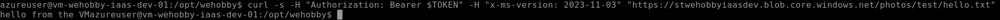

#### 4. Delete

```bash
curl -s -o /dev/null -w "%{http_code}\n" -X DELETE -H "Authorization: Bearer $TOKEN" -H "x-ms-version: 2023-11-03" "https://stwehobbyiaasdev.blob.core.windows.net/photos/test/hello.txt"
```

Expected: `202`

#### Troubleshooting

| Response | Meaning | Fix |
|---|---|---|
| `403` `AuthorizationPermissionMismatch` | Identity has no data role | Check the role assignment (step 7). New assignments can take a few minutes |
| `403` `AuthorizationFailure` | Blocked by the storage firewall | Check the storage networking allows `snet-app` and the subnet has the `Microsoft.Storage` service endpoint |
| Empty token | Managed identity not enabled | VM → **Security** → **Identity** → System assigned: On |

| Check | Result |
|---|---|
| Token obtained | yes |
| Upload | 201 |
| Read | `hello from the VM` |
| Delete | 202 |

> **Good to know:** `169.254.169.254` is the Instance Metadata Service, reachable only from inside the VM. It hands out tokens for the VM's managed identity, so the app never stores a storage key.

> **My notes:**
> [Configure managed identities on Azure virtual machines (VMs)](https://learn.microsoft.com/en-us/entra/identity/managed-identities-azure-resources/how-to-configure-managed-identities?pivots=qs-configure-portal-windows-vm)

---

----

## Step 10: Backups (not implemented)

**Decision:** no backups for this environment.

| Reason | Detail |
|---|---|
| Cost | Snapshots and backup storage add a monthly cost for no benefit in dev |
| Dev environment | No real user data. The database can be recreated from scratch |

**What production would need:**

| Layer | Approach |
|---|---|
| Database | Nightly `pg_dump -Fc` to a private Blob container (Cool tier), uploaded with the VM's managed identity, scheduled with cron |
| Retention | Blob lifecycle rule deleting backups after 30 days |
| Disk | Incremental snapshots of the data disk, or Azure Backup for the whole VM |
| Restore test | Regular restore into a separate database to prove backups work |

> **Good to know:** on a VM, backups are entirely your responsibility. In Scenario 02, Azure Database for PostgreSQL Flexible Server includes automated backups (7 days retention by default), with backup storage up to the provisioned storage size at no extra cost.

> **My notes:**
>[Overview of Azure Blob backup](https://learn.microsoft.com/en-us/azure/backup/blob-backup-overview?tabs=operational-backup)
>[An overview of Azure VM backup](https://learn.microsoft.com/en-us/azure/backup/blob-backup-overview?tabs=operational-backup)
---

## Step 11: Deploy the app (milestone 1)

Replaces the placeholder page from step 9d with the real app: the web app and the API, behind Caddy, at `https://wehobby.app`. The database container and the data on `/datadisk` are kept.

| Container | Image | Ports | Data |
|---|---|---|---|
| `caddy` | `ghcr.io/gdamascenomoreira/wehobby-web` (Caddy + web build) | 80, 443 (public) | `/datadisk/caddy` |
| `api` | `ghcr.io/gdamascenomoreira/wehobby-api` | 3000 (Compose network only) | |
| `db` | `postgis/postgis:17-3.5` (unchanged) | 5432 (Compose network only) | `/datadisk/postgres` |

The compose file comes from the repo (`deploy/vm/compose.yaml`). The version that runs is set by `IMAGE_TAG` in `/opt/wehobby/.env`.

### 11a. DNS for the apex and www

Do this **before** step 11c. Caddy asks Let's Encrypt for the new names as soon as it starts, and the validation fails if they do not point at the VM yet.

1. Open the DNS zone `wehobby.app` (in `rg-wehobby-shared`) → **Recordsets** → **Add**

   | Field | Value |
   |---|---|
   | Name | `@` |
   | Type | A |
   | Alias record set | Yes |
   | Alias type | Azure resource |
   | Azure resource | `pip-vm-wehobby-iaas-dev-01` |
   | TTL | 1 hour |

2. **Add**, then repeat with Name `www`
3. Check from your computer:

```powershell
nslookup wehobby.app
nslookup www.wehobby.app
```

Expected: both return the VM public IP, the same as `iaas.wehobby.app`.

> **Good to know:** the apex (`wehobby.app` itself) cannot be a CNAME, which is why both records are A alias records pointing at the public IP resource. When the site moves to another scenario, only these two records change.

### 11b. Publish the images

1. Merge the milestone 1 pull request. The **Images** workflow (GitHub → **Actions** → **Images**) builds and pushes both images
2. Open the finished run → **Summary**, and write down the tag, for example `sha-1a2b3c4`
3. Make both packages public, once (new packages on ghcr.io are private):
   - GitHub → your profile → **Packages** → `wehobby-web` → **Package settings** → **Change visibility** → **Public**
   - Same for `wehobby-api`

> **Good to know:** public packages let the VM pull without storing a GitHub token on it. The images contain only the built app, no secrets.

### 11c. Switch the VM to the app

Connect with Bastion (step 9a), then:

#### 1. Back up the step 9d files

```bash
cd /opt/wehobby
```

```bash
mkdir -p backup-step9 && cp -rp compose.yaml Caddyfile site .env backup-step9/
```

#### 2. Download the compose file

Use the full commit SHA of the merge commit (GitHub → **Commits** → copy the full SHA), so the file matches the images:

```bash
COMMIT=<full commit sha>
```

```bash
curl -fsSL -o compose.yaml "https://raw.githubusercontent.com/gdamascenomoreira/wehobby/$COMMIT/deploy/vm/compose.yaml"
```

```bash
head -5 compose.yaml
```

Expected: the comment `# WeHobby on the scenario 01 VM.`

#### 3. Set the image tag

`.env` already holds `POSTGRES_PASSWORD` from step 9d. Keep it, and add the tag from 11b:

```bash
echo "IMAGE_TAG=sha-1a2b3c4" >> .env
```

```bash
grep -c '^POSTGRES_PASSWORD=' .env; grep '^IMAGE_TAG=' .env
```

Expected: `1` and your tag. (Do not `cat .env`: it would print the password.)

#### 4. Validate, pull and start

```bash
docker compose config --quiet
```

```bash
docker compose pull
```

```bash
docker compose up -d
```

```bash
docker compose ps
```

Expected: `caddy`, `api` and `db` running and `healthy`. `db` is not recreated because its settings did not change.

```bash
docker compose logs caddy --tail 50 | grep -i -E 'certificate obtained|error'
```

Look for `certificate obtained successfully` for `wehobby.app` and `www.wehobby.app` (`iaas.wehobby.app` reuses the certificate from step 9d).

| Setting | Why |
|---|---|
| Web build inside the Caddy image | The site and the edge config always ship together, as one tested version |
| `api` has no `ports` | Only Caddy is reachable from the internet. It forwards `/api/*` to the API |
| `IMAGE_TAG` in `.env` | Every deploy is a known commit; changing the tag is the deploy and the rollback |

### 11d. Test

From your computer:

```powershell
curl.exe -sI https://wehobby.app
curl.exe -sI https://www.wehobby.app
curl.exe -s https://wehobby.app/api/health
curl.exe -s https://iaas.wehobby.app/health
```

Expected:
- `HTTP/2 200` for `wehobby.app`, with `strict-transport-security` and `content-security-policy` headers
- `HTTP/2 301` from `www` with `location: https://wehobby.app/`
- `{"status":"ok","version":"sha-..."}`
- `ok`

Open `https://wehobby.app` on your phone: it shows **API status: ok**, and the language picker switches between Portuguese and English.

From the VM:

```bash
sudo ss -tlnp | grep -E ':(80|443|3000|5432) '
```

Expected: 80 and 443 only.

```bash
docker compose exec db psql -U wehobby -d wehobby -c "SELECT PostGIS_Version();"
```

Expected: `3.5 ...`, the same database as in step 9e.

#### Clean up

Once everything works, remove the files the new image replaces (the copies stay in `backup-step9/`):

```bash
rm -r site Caddyfile
```

### 11e. Roll back

To a previous version: put its tag back and restart.

```bash
sed -i 's/^IMAGE_TAG=.*/IMAGE_TAG=sha-<previous tag>/' .env
```

```bash
docker compose up -d
```

Back to the step 9d placeholder:

```bash
cp -rp backup-step9/compose.yaml backup-step9/Caddyfile backup-step9/site . && docker compose up -d --remove-orphans
```

### Result

| Check | Result |
|---|---|
| `@` and `www` resolve to the VM | |
| Image tag deployed | |
| Certificates for `wehobby.app` and `www` | |
| `https://wehobby.app` shows API status: ok | |
| `www` redirects to the apex | |
| `/api/health` | |
| Only 80 and 443 listening | |
| Database data still there | |

> **Good to know:** with auto shutdown on, the site is down while the VM is off. When the VM starts again, Docker starts and `restart: unless-stopped` brings the three containers back, with no manual step.

> **Good to know:** the `Strict-Transport-Security` header tells browsers to use HTTPS only. The whole `.app` domain is already on the browsers' HTTPS-only list, so this adds no new risk, but it means every `*.wehobby.app` name must always have a valid certificate.
